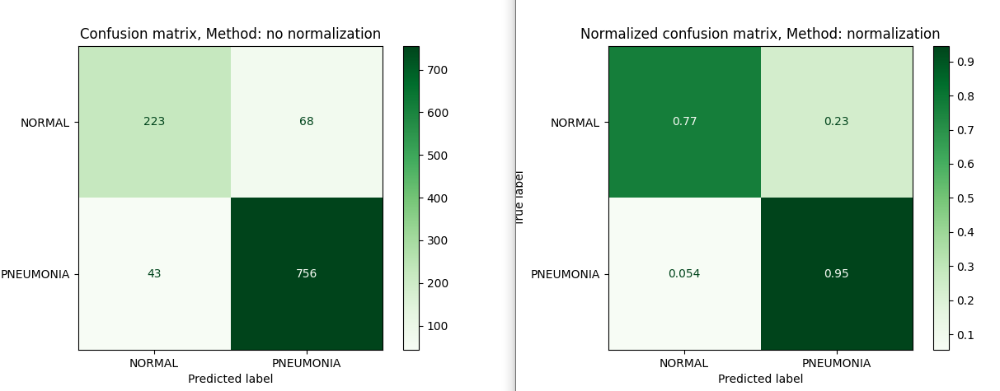
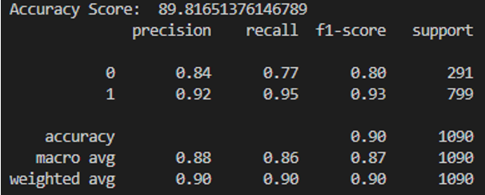
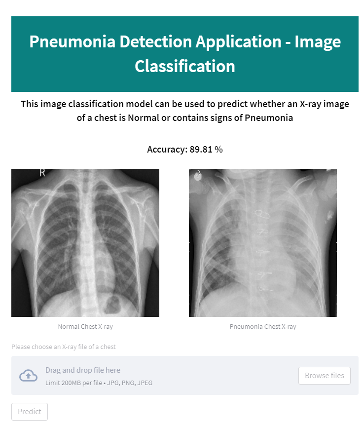

# About Pneumonia Detection Application - Computer Vision

This image classification project was built to detect Pneumonia in Chest X-Rays. The Web application will detect whether a chest x-ray is NORMAL or has PNEUMONIA. This application uses a machine model that was trained and tested with 2500+ sample images of both Normal and Pneumonia X-rays using Support Vector Machines. This model was trained using the SIFT descriptor algorithm and K-means clustering to cluster the main features of each image in order to successfully classify the X-ray images. 

Overall, after manipulating the model to increase the accruacy score, the accuracy of the model is 89.81 %. 

## Dataset

The dataset that was used is taken from Kaggle at https://www.kaggle.com/paultimothymooney/chest-xray-pneumonia. This contains over 5,000 different images of Normal and Pneumonia X-rays.

## Model Results
Confusion Matrix: 

Performance Results:

Web Page Preview:

## Tech stack / framework used
`Streamlit` framework using openCV, sklearn and Python

## Dependencies
- openCV 
- Numpy
- Matplotlib
- pickle
- sklearn
- pandas
- streamlit
- Pillow

## Prerequisites
-Python 3.1 

## Setup Environment
1. Download the project folder or fork the project 
2. Install all relevant dependencies in the project
3. [Optional] To run and train the model: run "imageClassificationModel.py"
4. To run the web application: run "py -m streamlit run guiModel.py"
